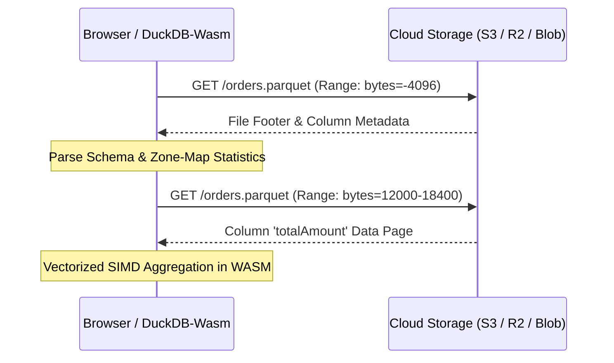

# 04 - Browser & WebAssembly Parquet Querying

This guide details how to query remote Apache Parquet files directly inside the browser using **DuckDB-Wasm** and HTTP range requests, eliminating the need for server-side SQL query proxies.

---

## 🚀 The HTTP Byte-Range Architecture

Because Parquet stores column chunks and metadata footers contiguously, WebAssembly query engines do not need to download the full file:

1. **Footer Range Request**: The engine requests the final few kilobytes containing the `FileMetaData` footer and schema.
2. **Page Index / Zone-Map Check**: The engine inspects min/max statistics for row groups to eliminate non-matching data.
3. **Targeted Column Chunks**: Only the byte ranges of projected and filtered columns are requested via HTTP `Range: bytes=start-end`.



---

## 💻 Sample Implementation

```typescript
import * as duckdb from '@duckdb/duckdb-wasm';

export async function queryParquetFile(url: string, minAmount: number) {
  const db = await initDuckDB();
  const conn = await db.connect();

  // Query remote file directly via HTTP range requests
  const results = await conn.query(`
    SELECT status, COUNT(*) AS count, SUM(totalAmount) AS total
    FROM parquet_scan('${url}')
    WHERE totalAmount >= ${minAmount}
    GROUP BY status
    ORDER BY total DESC
  `);

  return results.toArray();
}
```
